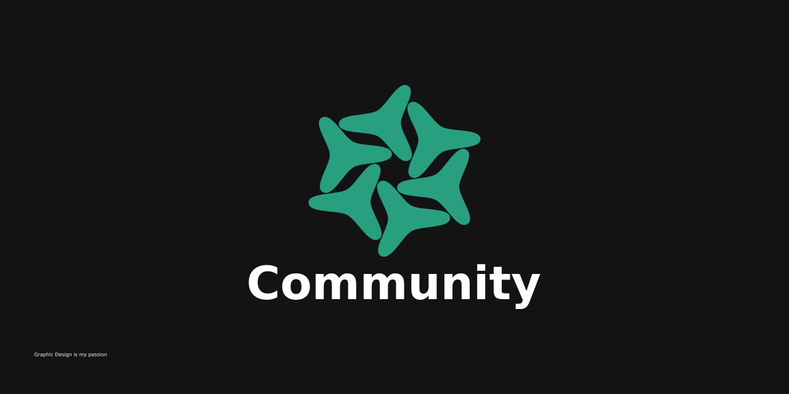

# Community

#### Video Demo: <URL HERE>

#### Description:

`Community` is an app designed to help communities organize themselves made as my final project for `CS50 2024`. The app provides ways to create issues that are affecting the community for example potholes, illegal trash dumps, and broken lights; events that members want to host like markets, clean ups, and fund raisers. I originally wanted to include groups as well but as I started developing I realized that the scope was too large for my one person team.

Issues are created in the app with a multi-screen form. Each Issue is made up of a type to help people quickly decide if they are interested in it, a short description which is optional *, and a location.

Events are created in the same why issues are but were much more work to get working. Events contain a type, title, description, age limit, dress code, ticket website \*, links \*, kit \*, days, and tags \*. Each day for every event has a start and end times, a date, and a location. 

I chose to have the location and time tied to the day and not the event in order to support events that have different locations for each day. In my original plan, days were going to have a list of locations or a path instead of just one location, this was in order to accommodate events that move throughout the day but sadly I couldn't get this in if I was to make the deadline.

Users can set interests and a community location to filter their feed page. I use the location to get all the events and issues that are within a 100km radius. Users can also view all the events and issues of any user, change their own usernames, and upload a profile picture.

> [!NOTE]
> An * indicates values that are not required

#### Technologies

For this project I decided to learn some new tech so I used `React Native` and `Expo` for the app itself, `Supabase` for the backend, and `Resend` for the emails. If I were to start again I may use something else for the backend so the users do not have access to my database. Although React Native gave me problems I do not think I would have traded it for Flutter, what I normally use, because I found that the dependencies with React Native not to be as horrible as they can be with Flutter.

#### Biggest Challenges
I faced some huge challenges during this project like finishing my GED, extreme burnout, and moving house twice.

#### Know Issues
+ Map modal does not work correctly on Android (Library problem)
